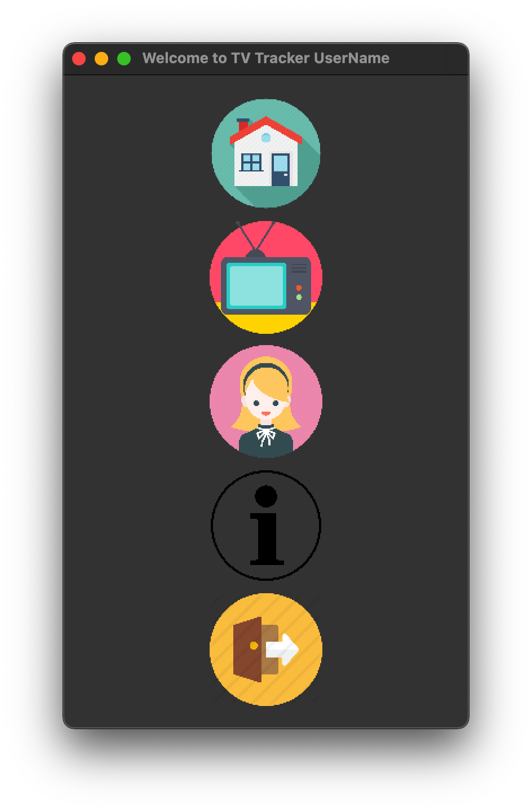
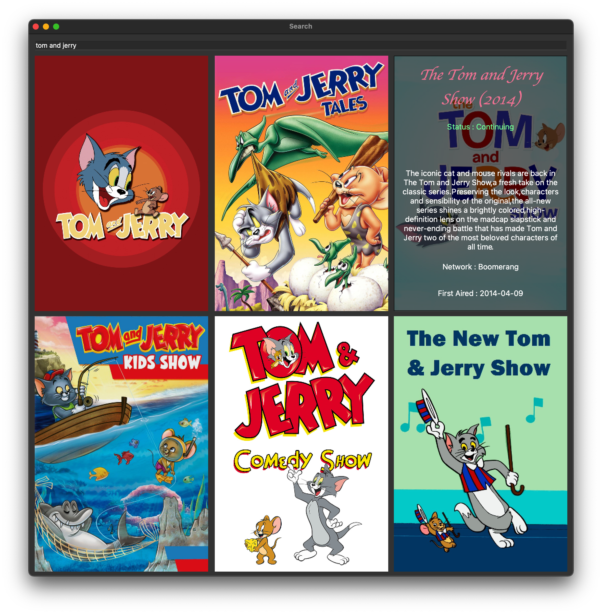

# TV Tracker

TV Tracker is an application that will let the user search for TV Shows and keep track of them. This application is powered by [PyQt5](https://www.riverbankcomputing.com/software/pyqt/).

## Installation

Use the package manager [pip](https://pip.pypa.io/en/stable/) to install the necessary dependencies for TV Tracker to run.

```bash
pip install -r requirements.txt
```

## Usage
Get API keys from [TheTVDB](https://thetvdb.com/).


```shell
python gui/gui.py
```




## License
[MIT](https://choosealicense.com/licenses/mit/)